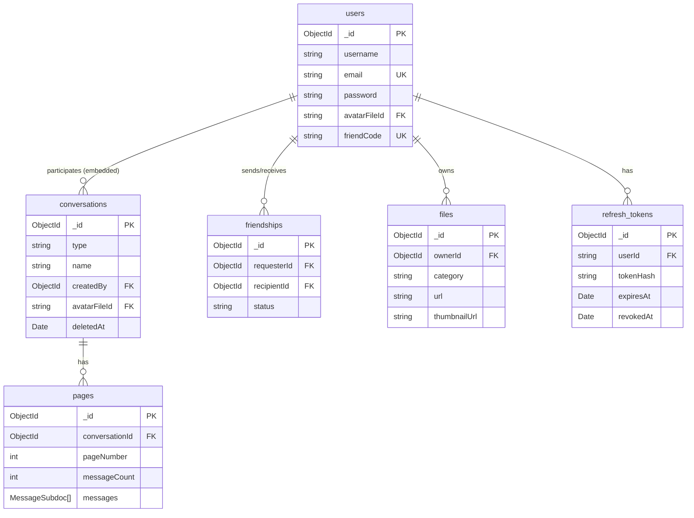

# Database Schema — BabyChat

Tài liệu mô tả toàn bộ MongoDB collections, fields, constraints, và indexes của BabyChat backend.

- **Database:** MongoDB (Mongoose 8)
- **Connection:** `MONGODB_URI` env var (default dev: `mongodb://127.0.0.1:27017/BabyChat`)
- **Tất cả IDs** là MongoDB ObjectId (string hex khi trả về client)

---

## Tổng quan Collections

| Collection | Mô tả |
|---|---|
| `users` | Tài khoản người dùng |
| `conversations` | Hội thoại (direct / group / channel) + participants nhúng |
| `pages` | Phân trang tin nhắn (messages nhúng trong page) |
| `friendships` | Quan hệ bạn bè giữa 2 user |
| `files` | Metadata file đã upload (avatar, image) |
| `refresh_tokens` | Refresh token (lưu hash, không lưu plaintext) |

---

## 1. Collection: `users`

| Field | Type | Required | Ghi chú |
|---|---|---|---|
| `_id` | ObjectId | ✓ | Auto-generated |
| `username` | string | ✓ | Tên hiển thị, không unique |
| `email` | string | ✓ | **Unique**. Dùng để đăng nhập |
| `password` | string | ✓ | bcrypt hash (10 rounds) — không bao giờ trả về client |
| `displayName` | string | ✗ | Tên hiển thị tùy chọn |
| `dateOfBirth` | Date | ✗ | Ngày sinh |
| `avatarFileId` | string | ✗ | Ref ObjectId → `files._id`. Ưu tiên hơn URL string |
| `friendCode` | string | ✗ | 8 ký tự, unique (sparse). Lazy-init khi user gọi `GET /users/me/friend-code` |
| `listChats` | ObjectId[] | ✗ | Ref → `conversations._id` (legacy field, ít dùng) |
| `listGroups` | ObjectId[] | ✗ | Ref → `conversations._id` (legacy field, ít dùng) |
| `createdAt` | Date | ✓ | Auto (`timestamps: true`) |
| `updatedAt` | Date | ✓ | Auto (`timestamps: true`) |

**Indexes:**
```
email: 1          (unique)
username: 1
friendCode: 1     (unique, sparse — cho phép null/undefined)
```

---

## 2. Collection: `conversations`

| Field | Type | Required | Ghi chú |
|---|---|---|---|
| `_id` | ObjectId | ✓ | Auto-generated |
| `type` | enum | ✓ | `'direct'` / `'group'` / `'channel'` |
| `name` | string | ✗ | Bắt buộc nếu `type = 'group'` hoặc `'channel'` |
| `description` | string | ✗ | Mô tả nhóm |
| `avatar` | string | ✗ | URL avatar (legacy — dùng `avatarFileId` thay thế) |
| `avatarFileId` | string | ✗ | Ref ObjectId → `files._id` |
| `createdBy` | ObjectId | ✗ | Ref → `users._id` |
| `participants` | ParticipantSubdoc[] | ✓ | Mảng thành viên nhúng trực tiếp (min: 1) |
| `settings` | ConvSettingSubdoc | ✗ | Cài đặt nhóm |
| `deletedAt` | Date | ✗ | Soft delete. `null` = chưa xóa. Query mặc định filter `{ deletedAt: null }` |
| `createdAt` | Date | ✓ | Auto |
| `updatedAt` | Date | ✓ | Auto |

### Subdoc: `ParticipantSubdoc` (nhúng trong `conversations.participants`)

| Field | Type | Required | Ghi chú |
|---|---|---|---|
| `userId` | ObjectId | ✓ | Ref → `users._id` |
| `username` | string | ✓ | Snapshot username lúc join. User có thể đổi nickname trong conversation |
| `role` | enum | ✓ | `'admin'` / `'member'` / `'moderator'` |
| `joinedAt` | Date | ✓ | Default: `Date.now` |
| `leftAt` | Date | ✗ | Khi user rời nhóm |
| `isActive` | boolean | ✓ | Default: `false` |

### Subdoc: `ConvSettingSubdoc`

| Field | Type | Default | Ghi chú |
|---|---|---|---|
| `isPrivate` | boolean | `false` | Nhóm private |
| `allowInvites` | boolean | `true` | Cho phép member thêm người |
| `mutedBy` | ObjectId[] | `[]` | Ref → `users._id`. User tắt thông báo |
| `pinnedBy` | ObjectId[] | `[]` | Ref → `users._id`. User ghim conversation |

**Indexes:**
```
participants.userId: 1
createdBy: 1
type: 1
```

**Constraints:**
- `participants` array phải có ít nhất 1 phần tử (schema-level validation)
- `type = 'direct'` phải có đúng 2 participants (entity-level validation)
- `MAX_PARTICIPANTS = 500` (entity-level validation)

---

## 3. Collection: `pages`

Lưu tin nhắn theo trang. Mỗi page thuộc về 1 conversation, chứa mảng MessageSubdoc nhúng trực tiếp.

| Field | Type | Required | Ghi chú |
|---|---|---|---|
| `_id` | ObjectId | ✓ | Auto-generated |
| `conversationId` | ObjectId | ✓ | Ref → `conversations._id` |
| `pageNumber` | number | ✓ | Min: 1. Tăng dần khi page đầy |
| `pageSize` | number | ✓ | Default: 50, Max: 100 |
| `messageCount` | number | ✓ | Số tin nhắn hiện có trong page. Default: 0 |
| `startTime` | Date | ✓ | Thời điểm tin nhắn đầu tiên của page |
| `endTime` | Date | ✗ | Thời điểm tin nhắn cuối cùng |
| `messages` | MessageSubdoc[] | ✓ | Mảng tin nhắn nhúng |
| `createdAt` | Date | ✓ | Auto |
| `updatedAt` | Date | ✓ | Auto |

### Subdoc: `MessageSubdoc` (nhúng trong `pages.messages`)

| Field | Type | Required | Ghi chú |
|---|---|---|---|
| `_id` | ObjectId | ✓ | Auto-generated (dùng làm message ID) |
| `senderId` | ObjectId | ✓ | Ref → `users._id` |
| `content` | string | ✗ | Nội dung văn bản. Bắt buộc nếu `type = 'text'`. Có thể rỗng nếu `type = 'image'` (caption optional) |
| `type` | enum | ✗ | `'text'` / `'image'`. Default: `'text'` |
| `fileId` | string | ✗ | Ref ObjectId → `files._id`. Bắt buộc nếu `type = 'image'` |
| `replyId` | ObjectId | ✗ | `_id` của message được reply (trong cùng hoặc khác page) |
| `replySnippet` | string | ✗ | Snippet nội dung message được reply (max 80 ký tự). FE dùng để render preview |
| `replySenderId` | ObjectId | ✗ | Ref → `users._id`. userId của người gửi message được reply |
| `createdAt` | Date | ✓ | Default: `Date.now` |
| `updatedAt` | Date | ✓ | Default: `Date.now` |

**Indexes:**
```
conversationId: 1, pageNumber: 1   (unique — mỗi conversation có duy nhất 1 page cho mỗi số)
conversationId: 1
messages.senderId: 1
```

> **Tại sao dùng Page model?** Tránh array tin nhắn không giới hạn trong conversation document. Mỗi page là 1 document MongoDB độc lập, dễ phân trang và không bị document size limit.

---

## 4. Collection: `friendships`

| Field | Type | Required | Ghi chú |
|---|---|---|---|
| `_id` | ObjectId | ✓ | Auto-generated |
| `requesterId` | ObjectId | ✓ | Ref → `users._id`. Người gửi lời mời |
| `recipientId` | ObjectId | ✓ | Ref → `users._id`. Người nhận |
| `status` | enum | ✓ | `'pending'` / `'accepted'` / `'blocked'` |
| `acceptedAt` | Date | ✗ | Thời điểm chấp nhận |
| `createdAt` | Date | ✓ | Auto |
| `updatedAt` | Date | ✓ | Auto |

**Indexes:**
```
requesterId: 1, recipientId: 1   (unique — 1 chiều giữa 2 user là duy nhất)
recipientId: 1, status: 1
requesterId: 1, status: 1
```

**Quy tắc nghiệp vụ:**
- DB lưu **1 document** cho quan hệ `accepted` (không lưu 2 chiều)
- Chiều ngược lại có thể tồn tại riêng (vd: A block B → document `(A,B)` với status `blocked`)
- Khi chấp nhận lời mời → tự động tạo direct conversation (side effect trong use case)

---

## 5. Collection: `files`

| Field | Type | Required | Ghi chú |
|---|---|---|---|
| `_id` | ObjectId | ✓ | Auto-generated |
| `ownerId` | ObjectId | ✓ | Ref → `users._id` |
| `category` | enum | ✓ | `'user_avatar'` / `'conversation_avatar'` / `'message_image'` / `'other'` |
| `originalName` | string | ✓ | Tên file gốc từ client |
| `mimetype` | string | ✓ | MIME type (chỉ accept: `image/jpeg`, `image/png`, `image/webp`, `image/gif`) |
| `size` | number | ✓ | Kích thước bytes sau khi xử lý |
| `filename` | string | ✓ | Tên file trên storage (uuid.webp). Dùng để xóa vật lý |
| `url` | string | ✓ | URL truy cập (relative path `/uploads/...`) |
| `thumbnailUrl` | string | ✗ | URL thumbnail (được tạo tự động cho avatar) |
| `width` | number | ✓ | Chiều rộng pixels |
| `height` | number | ✓ | Chiều cao pixels |
| `createdAt` | Date | ✓ | Auto |

**Indexes:**
```
ownerId: 1
category: 1
```

**Upload constraints:**
- Max size: `UPLOAD_MAX_SIZE_MB` env (default: 5 MB)
- Ảnh được convert sang **WebP** và resize qua `sharp` (image-processor.ts)
- Avatar tự động tạo thêm thumbnail nhỏ hơn

---

## 6. Collection: `refresh_tokens`

| Field | Type | Required | Ghi chú |
|---|---|---|---|
| `_id` | ObjectId | ✓ | Auto-generated |
| `userId` | string | ✓ | userId của chủ sở hữu token |
| `tokenHash` | string | ✓ | SHA-256 hex hash của refresh token plaintext |
| `expiresAt` | Date | ✓ | Thời điểm hết hạn |
| `revokedAt` | Date | ✗ | `null` = còn active. Khi revoke: set `revokedAt = now` |
| `createdAt` | Date | ✓ | Auto |

**Bảo mật:**
- Plaintext token **không bao giờ được lưu**. Chỉ lưu SHA-256 hash.
- Khi verify: hash lại plaintext từ client → query DB `(userId, tokenHash)`.
- Token rotation: mỗi lần refresh, token cũ bị revoke, token mới được tạo.

---

## 7. Sơ đồ quan hệ


