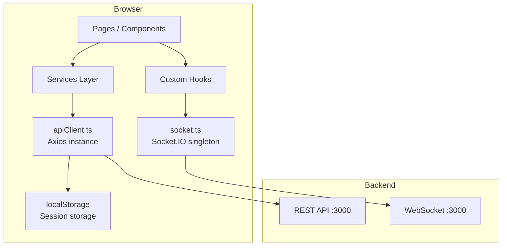
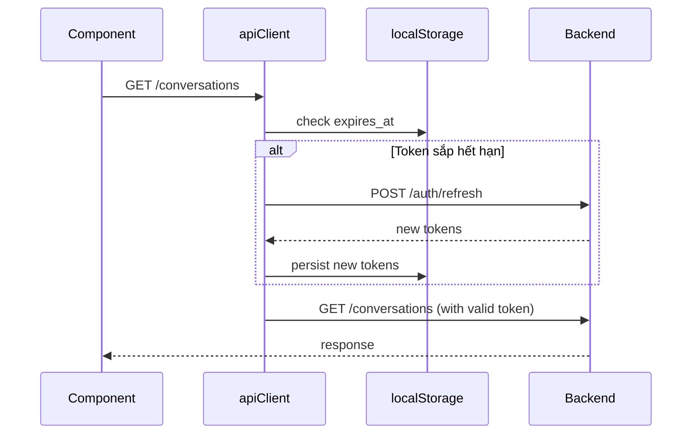

# Frontend Architecture — BabyChat

Tài liệu mô tả kiến trúc, cấu trúc thư mục, các pattern và quy ước của ứng dụng React frontend cho BabyChat.

- **Framework:** React 19 + TypeScript 5.8 + Vite 7
- **UI Library:** Ant Design 6 + Lucide React
- **Routing:** React Router DOM v6
- **HTTP Client:** Axios với interceptors tự động refresh token
- **Realtime:** Socket.IO Client 4.x

---

## 1. Cấu trúc thư mục

```text
frontend/src/
├── App.tsx                # Root component: routing, providers, global WS listeners
├── main.tsx               # Entry point — mount React vào DOM
├── index.css              # Global styles
│
├── api/
│   └── apiClient.ts       # Axios instance + request/response interceptors (token refresh)
│
├── config/
│   └── environmentLoader.ts  # Đọc env theo mode (dev/staging/prod), singleton pattern
│
├── lib/
│   ├── socket.ts          # Socket.IO singleton: connectSocket / getSocket / disconnectSocket
│   ├── wsEvents.ts        # WS event name constants + TypeScript payload interfaces
│   └── sound.ts           # Phát âm thanh thông báo
│
├── services/
│   ├── authService.ts     # Auth operations + session management (localStorage)
│   ├── conversationService.ts  # Conversation & message API calls
│   ├── friendService.ts   # Friendship API calls
│   └── fileService.ts     # File upload API calls
│
├── hooks/
│   ├── useSocketEvent.ts  # Subscribe 1 WS event, type-safe, auto cleanup
│   ├── useSocketConnect.ts # Handler khi socket (re)connect — refetch data bị miss
│   ├── useNotifications.ts # Notification state từ WS events (in-memory, max 20)
│   ├── useToast.ts        # Toast notification helpers
│   ├── useAntdApp.ts      # Access Ant Design app context (message, notification)
│   └── useThemeToken.ts   # Access Ant Design design tokens
│
├── types/
│   ├── api.types.ts       # TypeScript interfaces cho API responses (DTO types)
│   └── layout.ts          # Layout-related types
│
├── components/
│   ├── Layout/            # App shell
│   │   ├── Layout.tsx     # Wrapper: header + sidebar + content slot
│   │   ├── Header.tsx     # Top navigation bar (search, theme, notifications, profile)
│   │   ├── Sidebar.tsx    # Left sidebar (tùy chọn)
│   │   └── index.ts       # Re-export
│   ├── common/            # Generic reusable components (hiện đang rỗng)
│   └── feature/           # Feature-specific components (hiện đang rỗng)
│
└── pages/
    ├── Login.tsx          # Trang đăng nhập
    ├── SignUp.tsx         # Trang đăng ký
    ├── Home.tsx           # Trang chủ
    ├── Messages.tsx       # Trang chat chính (danh sách + khung chat)
    ├── Friends.tsx        # Quản lý bạn bè (danh sách, lời mời, thêm bằng code)
    ├── Profile.tsx        # Trang profile + upload avatar
    ├── About.tsx          # Trang giới thiệu
    └── Service.tsx        # Trang dịch vụ
```

---

## 2. Luồng dữ liệu và các layers



**Nguyên tắc:**
- **Pages/Components** không gọi `apiClient` trực tiếp — gọi qua `services/`
- **Hooks** không gọi API — chỉ subscribe WebSocket events và quản lý local state
- **Services** là pure async functions, không có React state
- **`apiClient`** là điểm duy nhất gửi HTTP request

---

## 3. Authentication & Session

### Lưu trữ session
Toàn bộ session được lưu trong `localStorage`. Không có React Context hay global state cho auth:

| Key | Giá trị |
|---|---|
| `access_token` | JWT access token |
| `refresh_token` | Refresh token (format: `userId.random`) |
| `access_token_expires_at` | ISO 8601 datetime |
| `refresh_token_expires_at` | ISO 8601 datetime |
| `userId` | User ID |
| `username` | Username |
| `email` | Email |

### authService — các method chính

```ts
authService.login(payload)              // POST /auth/login → persist session
authService.register(payload)           // POST /auth/register → persist session
authService.logout()                    // Xóa tất cả session keys
authService.getAccessToken()            // Đọc từ localStorage
authService.isAuthenticated()           // access_token tồn tại && refresh_token chưa hết hạn
authService.isAccessTokenExpired()      // Expires trong vòng 30s
authService.refreshAccessToken()        // Gọi /auth/refresh, cập nhật localStorage
```

### Token refresh tự động
Được xử lý trong 2 tầng của `apiClient.ts`:

1. **Proactive (request interceptor):** Trước mỗi request, kiểm tra xem access token có sắp hết hạn (< 30s) không. Nếu có → refresh trước khi gửi request. Nhiều request đồng thời sẽ được queue lại, chỉ gửi 1 refresh request.

2. **Reactive (response interceptor):** Khi nhận được 401 (token hết hạn bất ngờ) → thử refresh → retry request. Request public (`/auth/login`, `/auth/register`, `/auth/refresh`) không trigger refresh.



---

## 4. WebSocket Integration

### Singleton pattern
`lib/socket.ts` export một socket singleton. Chỉ 1 kết nối duy nhất tồn tại suốt phiên làm việc:

```ts
connectSocket(token)   // Tạo hoặc tái sử dụng socket instance
getSocket()            // Lấy instance hiện tại (null nếu chưa connect)
disconnectSocket()     // Ngắt kết nối + xóa instance (dùng khi logout)
```

### Lifecycle trong App.tsx
```tsx
// Kết nối socket ngay khi app load (nếu đã có token)
useEffect(() => {
  const token = authService.getAccessToken();
  if (!token) return;
  connectSocket(token);
}, []);
```

Socket **không disconnect khi component unmount** để tránh mất kết nối do React StrictMode render 2 lần.

### Auto-reconnect khi token hết hạn
`socket.ts` lắng nghe `connect_error`. Khi lý do là `'Unauthorized'` hoặc `'Token has been revoked'` → tự động refresh token → reconnect. Nếu refresh thất bại → redirect về `/login`.

### useSocketEvent hook
Type-safe hook để subscribe 1 WS event trong component:

```tsx
useSocketEvent(WS_EVENTS.MESSAGE_NEW, (payload) => {
  // payload được TypeScript infer đúng type: MessageNewPayload
  appendMessage(payload);
});
```

- Handler được lưu trong `useRef` → không cần memo hóa ở component
- Tự động cleanup khi component unmount hoặc event name thay đổi

### useSocketConnect hook
Gọi handler mỗi khi socket (re)connect. Dùng để refetch dữ liệu bị miss khi user offline:

```tsx
useSocketConnect(() => {
  refetchConversations();  // Bù dữ liệu đã miss
});
```

### Event contract
Tất cả WS event names và payload types được định nghĩa trong `lib/wsEvents.ts`:

```ts
export const WS_EVENTS = {
  MESSAGE_NEW: 'message.new',
  FRIENDSHIP_REQUEST_RECEIVED: 'friendship.request_received',
  FRIENDSHIP_ACCEPTED: 'friendship.accepted',
  CONVERSATION_CREATED: 'conversation.created',
} as const;
```

**Quy ước:** Không hardcode event name string trong component. Luôn dùng `WS_EVENTS.*`.

---

## 5. Services Layer

Services là các object chứa async functions, tương tác với `apiClient`. Không có React state.

| Service | Trách nhiệm |
|---|---|
| `authService` | Auth operations + session management |
| `conversationService` | Lấy conversations, pages, messages; gửi tin nhắn |
| `friendService` | Friendship CRUD, friend code, block/unblock |
| `fileService` | Upload ảnh, lấy metadata |

**Pattern gọi service trong component:**
```tsx
// Trong useEffect hoặc event handler
const conversations = await conversationService.getConversations();
```

---

## 6. Routing

Được định nghĩa trong `App.tsx`, tất cả routes dùng React Router DOM v6:

| Route | Component | Layout |
|---|---|---|
| `/` | `HomePage` | Có Header |
| `/login` | `Login` | Không có Layout |
| `/signup` | `SignUp` | Không có Layout |
| `/messages` | `MessagesPage` | Có Header |
| `/friends` | `FriendsPage` | Có Header |
| `/profile` | `ProfilePage` | Có Header |
| `/about` | `About` | Có Header |
| `/services` | `Service` | Có Header |

> **Lưu ý:** Hiện tại chưa có Route Guard (bảo vệ route cho user chưa đăng nhập). Kiểm tra auth đang được thực hiện trong từng page component.

---

## 7. UI & Theming

### Ant Design + Dark Mode
`App.tsx` wrap toàn bộ app trong `ConfigProvider`:
- Theo dõi class `dark` trên `document.documentElement` để toggle theme
- Design tokens tùy chỉnh: `colorPrimary: '#e8385a'` (đỏ hồng)

### Toast notifications
- `react-hot-toast` cho toast tạm thời (4s)
- `useNotifications` hook cho notification center in-memory (tối đa 20, persist trong session)
- Global notification sound (`lib/sound.ts`) được đặt trong `App.tsx`, áp dụng cho mọi trang

---

## 8. Cấu hình môi trường

`config/environmentLoader.ts` đọc env theo `Vite MODE`:

| Mode | Env var API URL | Features |
|---|---|---|
| `development` | `VITE_DEV_API_URL` | debugPanel, mockData, hotReload |
| `staging` | `VITE_STAGING_API_URL` | debugPanel |
| `production` | `VITE_PROD_API_URL` | — |

**File `.env` (dev):**
```bash
VITE_DEV_API_URL=http://localhost:3000
```

**Khởi động:**
```bash
npm run start:dev   # Development mode với Vite HMR
npm run build       # Production build
```

---

## 9. Quy ước code

| Concern | Quy ước |
|---|---|
| **File naming** | `PascalCase.tsx` cho components/pages; `camelCase.ts` cho logic files |
| **WS events** | Luôn dùng `WS_EVENTS.*`, không hardcode string |
| **API calls** | Qua `services/`, không gọi `apiClient` trực tiếp từ component |
| **Types** | API response types trong `types/api.types.ts`; không define inline trong component |
| **Socket** | Gọi `getSocket()` từ `lib/socket.ts`; không import `socket` variable trực tiếp |
| **State management** | Local state (`useState`) + localStorage cho session. Không có global state library |
| **Error handling** | Try/catch trong service functions hoặc event handlers; dùng `useToast` để thông báo |

---

## 10. Những điểm cần cải thiện (Deferred)

| Vấn đề | Mô tả | Ưu tiên |
|---|---|---|
| **Route Guard** | Chưa có ProtectedRoute — user chưa đăng nhập có thể truy cập `/messages` | Cao |
| **Global auth state** | Session trong localStorage không reactive — thay đổi token không tự cập nhật UI | Trung bình |
| **Error boundary** | Chưa có React Error Boundary để catch runtime errors | Trung bình |
| **`components/common` và `feature` rỗng** | Component reuse thấp — logic nằm trực tiếp trong pages | Thấp |
| **Socket disconnect on logout** | `authService.logout()` chưa gọi `disconnectSocket()` | Cao |
| **Loading/skeleton states** | Chưa có loading UI khi fetch data | Thấp |
